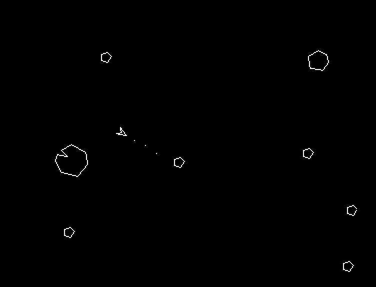

# Asteroids

Asteroids game developed for fun.
Uses blitter line draw.

# Development date

September 1989

# How to play

Use keyboard
- z to rotate left
- x to rotate left
- . to shoot
- / to thrust
Press left mouse button to exit

# How to run

Use a AsmOne V1.21 by Rune Gram-Madsen
- Use the a command to assemble
- Use the g command with g parameter to run

# Screenshot

