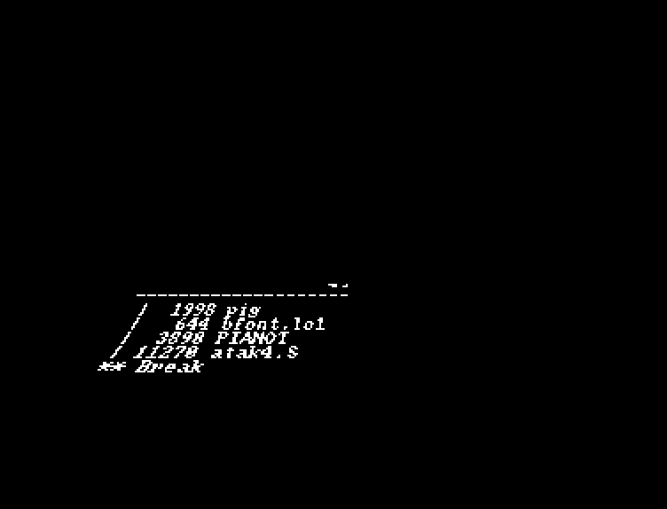

# Slowstar

An attempt at a Star Wars scroller done with the Blitter.

Not used for anything as i thought this was way to slow.

# How to run

Use a newer Version of Seka assembler (probably 3.0 and above).
- Use the a command to assemble
- Use the y command to load the external file
- Use the g command with g parameter to run

# Screenshot

